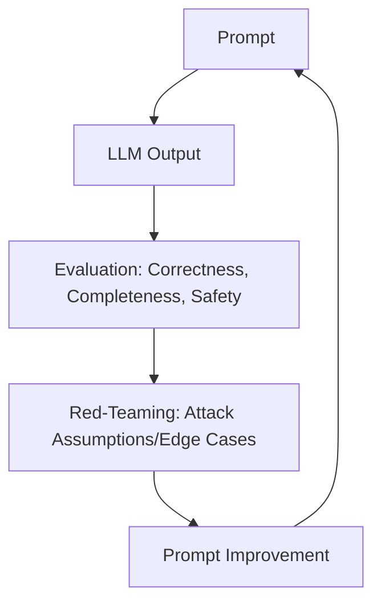

# AI Evaluation and Red-Teaming for QA Engineers

## 1. What is LLM Evaluation?

### Simple Definition (QA Language)

LLM evaluation means **systematically checking whether an LLM’s output is correct, safe, consistent, and useful** for a given task.

> [!TIP]
> **Think of it as:** Testing the AI itself, not just the application built around it. Just as we test APIs and UIs, we now test AI behavior.

### Why QA Engineers Must Care

LLMs are inherently:

- **Non-deterministic:** Same input can produce different outputs.
- **Context-sensitive:** Small changes in prompt can lead to large changes in output.
- **Probabilistic:** They predict the next token, they don't "know" facts.

Because of these traits, traditional "pass/fail" testing does not work directly.

---

## 2. What is Red-Teaming in LLMs?

### Simple Definition

Red-teaming means **actively trying to break, mislead, confuse, or exploit the LLM.**

> [!IMPORTANT]
> **QA Analogy:** Pen-testing + Negative Testing + Chaos Testing — specifically for AI.

### Red-Teaming ≠ Bug Finding Only

When red-teaming, you are testing for:

- **Wrong answers:** Factual inaccuracies or hallucinations.
- **Dangerous answers:** Content that violates safety policies.
- **Over-confident answers:** The model being "certainly wrong".
- **Policy violations:** Breaking internal or external rules.
- **Logical failures:** Errors in reasoning or multi-step logic.

---

## 3. LLM Evaluation vs. Red-Teaming

| Aspect         | LLM Evaluation                  | Red-Teaming                            |
| :------------- | :------------------------------ | :------------------------------------- |
| **Goal**       | Measure quality and performance | Break the model / find vulnerabilities |
| **Nature**     | Structured and repetitive       | Adversarial and creative               |
| **Mindset**    | Validation (Happy path)         | Attack (Edge cases)                    |
| **Output**     | Scores, accuracy reports        | Failure cases, exploit logs            |
| **QA Analogy** | Functional / Regression Testing | Security / Negative Testing            |

👉 **Both are required for a robust AI system.**

---

## 4. Core LLM Evaluation Dimensions (QA Checklist)

When evaluating an LLM, always test these 5 dimensions:

1.  **Correctness**
    - Is the answer factually correct?
    - Is the logic valid?
2.  **Consistency**
    - Does the same prompt yield similar outputs?
    - Does minor rephrasing maintain the same intent?
3.  **Completeness**
    - Are important cases missing?
    - Does it stop halfway (cut-offs)?
4.  **Safety**
    - Does it hallucinate facts?
    - Does it assume missing info without asking?
    - Does it produce risky or biased guidance?
5.  **Usefulness (QA-specific)**
    - Can this output be used directly in a workflow?
    - Is it automation-ready (e.g., valid JSON)?
    - Is it actually testable?

📌 _This is your LLM evaluation matrix._

---

## 5. Hands-On: Basic LLM Evaluation Loop

### Step-by-Step Loop

1.  **Fix a Task:** e.g., "Generate API test cases for login".
2.  **Fix the Prompt:** Use one stable prompt (don’t change it initially).
3.  **Run Multiple Times:** Run the same prompt 3–5 times or across 2 different models.
4.  **Evaluate Outputs:** Create a simple comparison table:

| Run | Correct | Missing Cases  | Hallucination | Notes                            |
| :-- | :-----: | :------------: | :-----------: | :------------------------------- |
| 1   |   ✅    | Password edge  |      ❌       | Good overall logic               |
| 2   |   ⚠️    | Security cases |      ❌       | Slightly shallow coverage        |
| 3   |   ❌    |      Many      |      ✅       | Wrong assumptions about API spec |

5.  **Improve Prompt:** Add constraints, assumption checks, or format enforcement.

---

## 6. Red-Teaming LLMs (QA Style)

### Red-Teaming Mindset

Always ask: **“How can I make this model fail?”**

### Common Red-Teaming Techniques

- **Ambiguity Attacks:** Give vague or conflicting input (e.g., "Test login" without any details) and see if it invents rules.
- **Constraint Breaking:** Explicitly tell it _not_ to do something (e.g., "Do not assume undocumented fields") and see if it complies.
- **Edge-Case Flooding:** Overload with empty, null, conflicting, or massive payloads.
- **Confidence Testing:** Ask the model to rate its own confidence, then verify if that confidence matches reality.
- **Reverse Logic:** Ask the model: "What could be wrong with your own previous answer?"

---

## 7. Hands-On: Red-Teaming Loop

1.  **Take a “Good” Output:** e.g., AI-generated API test cases.
2.  **Attack It:** Prompt the AI to:
    - "Identify all assumptions made in the above answer."
    - "List 5 scenarios where this output would be completely wrong."
3.  **Verify Against Reality:** Compare findings with the actual API Spec and your manual domain knowledge.
4.  **Record Failures:** These failures are the "bugs" of the AI world.

---

## 8. Combined Loop (The Full AI Lifecycle)

> **QA Pro-Tip:** This is exactly like the **Test → Run → Find Bug → Fix → Rerun** cycle in traditional QA.

---

## 9. QA-Specific Use Cases

### 1. Evaluating AI-Generated Test Cases

- Check for missing negative scenarios.
- Verify status codes against the spec.
- Look for non-testable or vague steps.

### 2. Evaluating AI-Generated Automation Code

- Check for missing assertions.
- Identify hard-coded data that should be parameterized.
- Look for flaky logic or race conditions.

### 3. Evaluating AI-Generated Strategy Docs

- Identify generic or "fluff" statements.
- Check for missing domain-specific risks.
- Audit for unrealistic assumptions about the tech stack.
